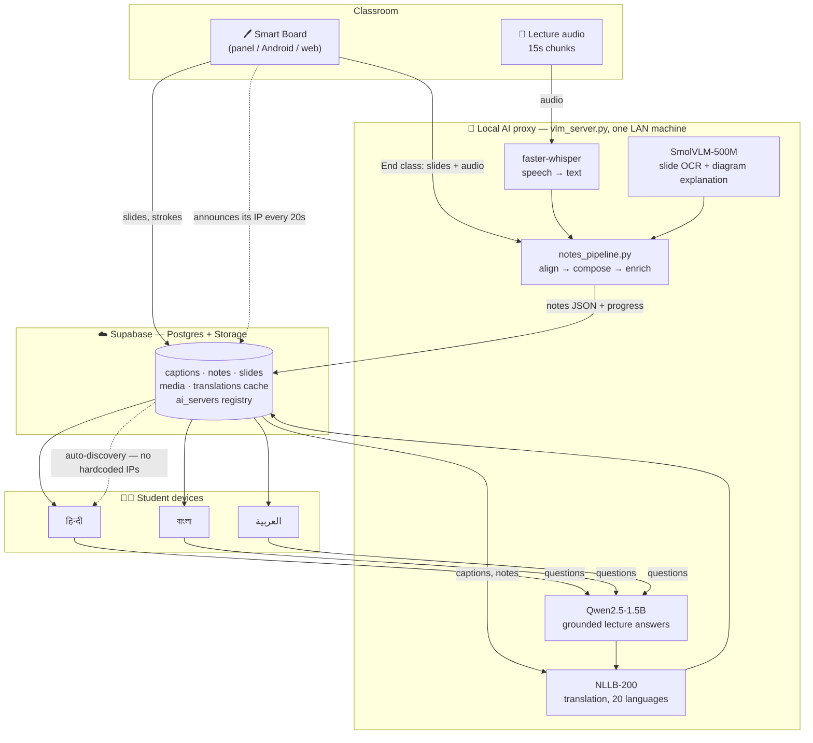

# कक्षा · Kaksha

### An AI-powered multilingual classroom assistant

**Problem Statement 1 — The Smart Classroom**

> *Can AI make a classroom lecture understandable to every student, regardless of the language they are most comfortable learning in?*

Kaksha's answer: **yes — and without the student ever asking for it.** The teacher keeps teaching in English. Every student sees the same lecture rendered into their own language — speech, whiteboard, diagrams, formulas and all — live during class, and as structured notes the moment class ends.

Built as one Flutter codebase (Android · iOS · Web · Windows · macOS · Linux) over a Supabase backend and a **fully local AI proxy** — no per-student API costs, no cloud dependency, works on a classroom LAN.

---

## Table of contents

- [The gap we attacked](#the-gap-we-attacked)
- [How it works in 60 seconds](#how-it-works-in-60-seconds)
- [Requirement traceability: every PS bullet → our implementation](#requirement-traceability)
- [Architecture](#architecture)
- [The AI stack](#the-ai-stack)
- [Two paths through a lecture](#two-paths-through-a-lecture)
- [Engineering decisions we're proud of](#engineering-decisions-were-proud-of)
- [Run it yourself](#run-it-yourself)
- [Demo script for judges](#demo-script-for-judges)
- [Tests](#tests)
- [Honest limitations](#honest-limitations)

---

## The gap we attacked

The problem statement contains a detail that most solutions miss:

> *"simply translating the teacher's speech does not help much when the important information is contained in a diagram, graph, image, handwritten note, or formula."*

A speech-to-speech translator solves maybe 40% of a Computer Science lecture. The rest of the meaning lives on **the board** — the tree diagram, the complexity curve, the recurrence relation. So Kaksha treats a lecture as **two synchronised streams** and refuses to drop either:

| Stream | Carried by | Made understandable by |
| --- | --- | --- |
| What the teacher **says** | Microphone → audio chunks | ASR → machine translation → live captions & dubbing |
| What the teacher **shows** | The smart board itself — strokes, slides, imported PDFs | Vision-language model reads the slide → translation |

Because the board *is* our app, we never OCR a photograph of a whiteboard taken from row 12. We rasterise the actual vector strokes at source. That is the single biggest accuracy advantage in this build.

---

## How it works in 60 seconds

1. The teacher opens the **Smart Board** on the classroom panel and teaches normally — writing, drawing, flipping slides, importing a PDF.
2. The board streams **15-second audio chunks** to the local AI proxy. Whisper transcribes them; captions land in Supabase; every student's device renders them **in that student's own language**.
3. A student who wants a closer look taps any slide → **Translate slide** (VLM transcribes the handwriting, formulas and lists, then translates) or **Describe this slide** (VLM explains the diagram/graph in plain words). Both arrive in the student's language.
4. The teacher presses **End class**. The board ships its slides + the lecture audio to the proxy, which runs the full pipeline and writes progress into Supabase so students watch a **live progress bar**, not a spinner.
5. Minutes later every student has **structured notes** — overview, simplified summary, key concepts (illustrated from Wikipedia), technical terms, per-slide breakdown, and the full transcript — in their language, exportable to PDF.
6. Anything still unclear? The student opens the **lecture chatbot** and asks in their own language. It answers from *this* lecture's transcript and notes, not from general knowledge.

---

## Requirement traceability

Every bullet in the problem statement, mapped to the code that implements it. This is the table we'd want a judge to read.

| # | PS requirement | How Kaksha does it | Where |
| --- | --- | --- | --- |
| 1 | **Select a language** — English, Hindi, Bangla, Arabic | **20 languages** shipped: English, Hindi, Bengali, Tamil, Telugu, Marathi, Gujarati, Punjabi, Kannada, Malayalam, Odia, Assamese, Urdu, Nepali, Spanish, French, German, **Arabic**, Chinese, Japanese. Set once at registration, changeable mid-class — the UI and all content re-render live. | [`data/languages.dart`](lib/data/languages.dart), [`widgets/language_picker.dart`](lib/widgets/language_picker.dart) |
| 2 | **Translate the teacher's lecture** | Audio chunked every 15 s → faster-whisper → captions → NLLB-200 translation → student's device. Plus **TTS dubbing** so a student can *listen* in their language. | [`/live_chunk`](vlm_server.py), [`board_screen.dart:126`](lib/screens/board/board_screen.dart#L126), [`media_viewer.dart`](lib/screens/shared/media_viewer.dart) |
| 3 | **Generate structured class notes** | `compose_notes()` emits a fixed JSON schema: overview, simplified summary, key concepts, technical terms, per-slide summary + the transcript spoken *while that slide was on screen*, and the full transcript. Rendered in-app and exportable as PDF. | [`notes_pipeline.py`](notes_pipeline.py), [`services/notes_pdf.dart`](lib/services/notes_pdf.dart) |
| 4 | **Read text from classroom images / whiteboards** | SmolVLM-500M-Instruct reads the rasterised slide — handwriting, lists, line breaks preserved. Imported PDFs become slide backgrounds and are read the same way. Prompt explicitly demands verbatim transcription. | [`services/ai.dart:155`](lib/services/ai.dart#L155), [`/generate`](vlm_server.py) |
| 5 | **Explain diagrams, graphs, charts** | A second, different prompt to the same VLM asks for a student-facing explanation of *what is drawn* — topic, diagram, key points — rather than a transcription. This is the "Describe this slide" button. | [`services/ai.dart:168`](lib/services/ai.dart#L168) |
| 6 | **Preserve formulas and technical terms** | Three defences: (a) the VLM prompt orders it to keep formulas and line breaks as written; (b) translation is **sentence-chunked**, so a formula never gets split mid-expression across two requests; (c) notes carry a dedicated `technical_terms` block mined from the *slides* rather than the speech, so jargon survives even when the ASR mangles it. The `lectra` pipeline goes further and preserves maths as **LaTeX** and code as fenced blocks. | [`notes_pipeline.py`](notes_pipeline.py), [`vlm_server.py`](vlm_server.py) `_split_for_translation`, [`extraction system/`](extraction%20system/README.md) |
| 7 | **Simple explanation of difficult concepts** | Notes ship a `simplified_summary` alongside the formal overview, and `key_concepts` pair each term with the sentence that introduced it — then get **illustrated with a Wikipedia thumbnail and one-line gloss**, so an abstract term arrives with a picture. | `wiki_enrich()` in [`notes_pipeline.py`](notes_pipeline.py) |
| 8 | **Ask questions using an AI assistant** | A real instruct model (Qwen2.5-1.5B) with **retrieval**: the question is scored against chunked notes + transcript, the top-6 relevant chunks are retrieved *in narrative order*, and the model is system-prompted to answer as this class's teacher using only that material. The answer is translated back to the student's language. | [`/chat`](vlm_server.py), `retrieve_context()` in [`notes_pipeline.py`](notes_pipeline.py) |

### The five required technologies

| Required | Our implementation |
| --- | --- |
| **Speech Recognition** | faster-whisper `small`, int8, VAD-filtered — chosen over `base` specifically because Hindi and other Indic accuracy jumps |
| **Large Language Models** | Qwen2.5-1.5B-Instruct for grounded lecture Q&A; optional Gemini polish for notes |
| **Machine Translation** | NLLB-200-distilled-600M running locally (20 languages via FLORES-200 codes), MyMemory as a network fallback |
| **OCR** | SmolVLM reads rendered slides; PaddleOCR (with a system-tesseract fallback) in the `lectra` pipeline for scanned PDF pages and slide text |
| **Computer Vision** | SmolVLM for diagram/graph explanation; OpenCV + perceptual hashing in `lectra` for slide-change detection and deduplication |

---

## Architecture



**Three surfaces, one codebase:**

| Surface | Who | What it carries |
| --- | --- | --- |
| **Student dashboard** | Students | Class calendar, notes in their language, live captions, assignments, doubt tickets, class media, lecture chatbot |
| **Teacher dashboard** | Teachers | Weekly slots, attendance, assignments, doubts, subject-scoped media uploads |
| **Smart Board** | The classroom panel | Live whiteboard + slides, PDF import, live captions, **End class** → notes |

---

## The AI stack

Everything runs **locally on one machine on the classroom network**. Roughly 6–7 GB of weights are downloaded on first use, and each model **lazy-loads only when first called** — so the server starts in seconds and a class that never opens the chatbot never pays for Qwen. No API key is required for any core feature.

| Job | Model | Why this one |
| --- | --- | --- |
| Speech → text | `faster-whisper` (`small`, int8) | int8 runs on a CPU-only laptop; `small` beats `base` materially on Hindi |
| Slide OCR + diagram explanation | `HuggingFaceTB/SmolVLM-500M-Instruct` | 500M params reads handwriting and describes diagrams while staying laptop-viable |
| Translation | `facebook/nllb-200-distilled-600M` | Genuinely strong on Indic languages, where general LLMs and free APIs fall apart |
| Lecture Q&A | `Qwen/Qwen2.5-1.5B-Instruct` | A *real* instruct model — we started with the vision model here and the answers were unusable |

Each is overridable: `WHISPER_MODEL`, `TRANSLATE_MODEL`, `CHAT_MODEL`.

**Bonus pipeline —** [`extraction system/`](extraction%20system/README.md) (`lectra`) is a standalone CLI that converts a lecture video *or* PDF into one validated JSON: slide-change detection by perceptual hash, deduplicated slides keeping every appearance range, LaTeX-preserved equations, chapters, and key concepts with first-seen timestamps.

```bash
lectra process lecture.mp4 --output lecture.json --mode deep
```

---

## Two paths through a lecture

**Path A — live, during class.** A timer rotates the board's recording every **15 seconds** and posts each chunk to `/live_chunk`. The proxy returns immediately and transcribes on a background thread, writing to `live_captions`; a bad chunk is caught and logged so *one glitch can never kill the class*. Students' devices read captions and translate them on the fly.

**Path B — after class.** The teacher uploads the recording. `/lecture_media` transcribes the audio **once** into `media_captions`, which then serves double duty: player subtitles (translated per-student, cached per language so the second student in Bangla pays nothing) *and* the transcript that gets fused with the slides into class notes.

Then the alignment step that makes the notes actually good:

```
align_segments(transcript_segments, slide_marks, slide_count)
   → every spoken sentence is attached to the slide that was on screen when it was said
```

So a note doesn't just say *"Slide 4: binary search tree"* — it says what the teacher **said** while slide 4 was up. That's the join between the two streams, and it's what separates these notes from a transcript with pictures.

Long Whisper segments are re-split by `split_caption_segments()` into real timed subtitle lines (≤90 chars, ≤8 s) so captions read like subtitles rather than paragraph dumps.

---

## Engineering decisions we're proud of

**Zero-config server discovery.** Classroom Wi-Fi hands out a new IP every day; hardcoded IPs die on demo morning. `vlm_server.py` republishes its address to the `ai_servers` table every 20 seconds, clients cache it for 15 s, and any failed request drops the cache so the next call re-resolves. **The demo survives an IP change mid-presentation.**

**Translate once, serve many.** A 40-student class means 40 requests for the same Bangla notes. Translations are cached per `(content, language)` in Postgres, so the second student's notes open instantly and the proxy stays free for live work.

**Nothing heavy on the UI thread.** Compression and AES-CTR encryption of class media run in **Dart isolates**, and board rebuilds are throttled. This directly killed the "app not responding" freezes — see commit `372eda8`.

**Retrieval before generation.** A 1.5B model handed a 10,000-word transcript rambles. Handing it the six most relevant chunks *in original narrative order* makes it answer like a teacher. Cheap, offline, no vector DB.

**Graceful degradation everywhere.** Wikipedia enrichment, Gemini polish, and MyMemory fallback are all `try/except` — every one is a bonus, never a blocker. Notes generate with no internet beyond the LAN.

**Sparse-slide skipping.** Slides with almost no strokes never reach the VLM (`stroke_counts`), cutting End-class time substantially on a 30-slide board.

**Encrypted class media.** Uploads are gzipped and AES-CTR encrypted client-side before they touch storage.

---

## Run it yourself

### 1 · Get the code

```bash
git clone https://github.com/Sameer-64bit/Bob_Hacks_PS.git
```

```bash
cd Bob_Hacks_PS
```

Prefer no Git? On the GitHub page use **Code → Download ZIP**, unzip, and continue here.

### 2 · Install dependencies

Requires [Flutter](https://docs.flutter.dev/get-started/install) (Dart SDK 3.5+).

```bash
flutter pub get
```

```bash
flutter doctor && flutter devices
```

### 3 · Set up Supabase

1. Create a free project at [supabase.com](https://supabase.com).
2. **SQL Editor** → run the schema files **in order**: `schema.sql`, then `schema_v2.sql` … through `schema_v9.sql`. Each header says what it adds; re-running is harmless. (`schema_v8.sql` is standalone and also contains v7.)
3. **Project Settings → API** → copy the **Project URL** and the **anon public** key.
4. Create your local secrets file:

```bash
cp env.example.json env.json
```

5. Paste your two values into `env.json`. It's gitignored — credentials never enter source control.

### 4 · Start the AI proxy

Any machine on the same network. A GPU helps; CPU works.

```bash
pip install -r server_requirements.txt
```

```bash
python vlm_server.py
```

Listens on port `5000` (override with `PORT`) and self-announces to Supabase. Verify:

```bash
curl http://localhost:5000/health
```

### 5 · Run the app

```bash
flutter run --dart-define-from-file=env.json
```

Without the flag the app opens its setup screen instead of connecting — it won't crash.

### Build for the classroom panel

People's Link interactive panels run Android or Windows.

**Android panel — release APK:**

```bash
flutter build apk --release --dart-define-from-file=env.json
```

The APK lands at `build/app/outputs/flutter-apk/app-release.apk`. Install over USB:

```bash
adb install -r build/app/outputs/flutter-apk/app-release.apk
```

No `adb`? Copy the APK to the device, open it in the file manager, and allow *Install unknown apps* when prompted. For storage-tight panels build per-architecture:

```bash
flutter build apk --release --split-per-abi --dart-define-from-file=env.json
```

**Any panel with a browser:**

```bash
flutter build web --dart-define-from-file=env.json
```

Serve `build/web/` from any static host.

### Optional: Gemini

Notes polish and `lectra`'s deep mode can use Gemini. Put a key from [aistudio.google.com/apikey](https://aistudio.google.com/apikey) in `env.json` under `GEMINI_API_KEY`, or leave it as `local-proxy-mode` to stay fully local. To pin the proxy address manually, fill in `AI_SERVER_URL`; leave it empty for auto-discovery.

---

## Demo script for judges

1. **Register a student** — name, roll no, *B.Tech CSE*, *1st Year*, language **हिन्दी**. Auto-enrolled, gets a classroom code like `CSE1-7KQ2`.
2. **Register a teacher** — name + employee ID → add a weekly slot. The classroom links automatically; the student's calendar fills in.
3. **Open the Smart Board**, enter the code. Write a formula, draw a diagram, import a PDF slide.
4. **Talk for a bit.** After the first 15-second chunk closes, live captions appear on the student device **in Hindi**.
5. On the student device, tap a slide → **Describe this slide**. The VLM explains the diagram, in Hindi.
6. **Switch the student's language to العربية** mid-class. Everything re-renders. Nothing reloads.
7. Press **End class** on the board. Watch the progress bar fill as the pipeline runs.
8. Open the generated **notes** — overview, key concepts with Wikipedia illustrations, per-slide breakdown, transcript. Export to PDF.
9. Open the **chatbot** and ask a question about something the teacher said. It answers from this lecture.

---

## Tests

```bash
flutter test
```

```bash
python -m pytest test_notes_pipeline.py
```

```bash
python -m pytest "extraction system/tests"
```

9 Dart suites cover the board controller, notes composition, media codec, models and the translator's chunking; 7 Python suites cover the `lectra` router, schema validation, slide dedup, scanned-page detection and the multi-call understanding layer. Network-dependent steps (Wikipedia, Gemini) take injectable `fetch` functions specifically so they can be tested offline.

---

## Honest limitations

We'd rather state these than have them found:

- **Notes composition is extractive, not abstractive**, when Gemini is off — it selects and structures real sentences rather than rewriting them. Reliable and hallucination-free, but less fluent than an LLM rewrite. The `gemini_enhance()` hook exists for when a key is available.
- **`key_concepts` uses frequency + capitalisation heuristics**, not an LLM. Fast and offline; occasionally picks a dull term.
- **The prototype has open RLS policies** and no auth. Correct for a hackathon demo, not for deployment. The anon key is build-time injected and gitignored, but the schema itself would need real row-level security before any real classroom use.
- **SmolVLM-500M is small.** It reads clean handwriting and standard diagrams well; dense subscripted mathematics is where it strains. `lectra`'s Gemini deep mode is the path to better.
- **Live captions lag by roughly one chunk** (~15 s) — inherent to chunked streaming ASR. Shortening `_chunkSeconds` trades latency for transcription quality, since Whisper has less context per chunk.

---

## Project layout

```
lib/                     Flutter app — landing → student / teacher / board
  screens/board/         whiteboard, live view, PDF export, history
  screens/student/       dashboard, notes, assignments, doubts
  screens/teacher/       dashboard, attendance, media, doubts
  services/              ai · translator · repositories · notes PDF · slide raster
supabase/schema*.sql     database, applied v1 → v9 in order
vlm_server.py            FastAPI proxy: /generate /live_chunk /lecture_media
                         /end_class /chat /translate /health
notes_pipeline.py        align → compose → chunk → retrieve → enrich
extraction system/       lectra — video/PDF → structured JSON (standalone CLI)
video_to_ppt/            lecture video → slides helper
```

---

## Troubleshooting

| Symptom | Fix |
| --- | --- |
| `flutter: command not found` | Install Flutter, add to `PATH`, verify with `flutter doctor` |
| App opens straight to the setup screen | No credentials reached the build — create `env.json` and pass `--dart-define-from-file=env.json` |
| App connects but no data | Run all schema files, `schema.sql` → `schema_v9.sql`, in order |
| AI buttons show a setup hint | The proxy isn't reachable. Confirm `python vlm_server.py` is running on the same network and `schema_v3.sql` has been applied |
| Android build fails on `record_linux` | Already handled by `dependency_overrides` in `pubspec.yaml` — re-run `flutter pub get` |
| First AI call is very slow | Models lazy-load on first use. Warm them with one slide read before the demo |
| APK won't install | Enable *Install unknown apps* for your file manager, or use `adb install -r` |

---

<div align="center">

**Kaksha** — because a student shouldn't have to translate faster than the professor talks.

</div>
